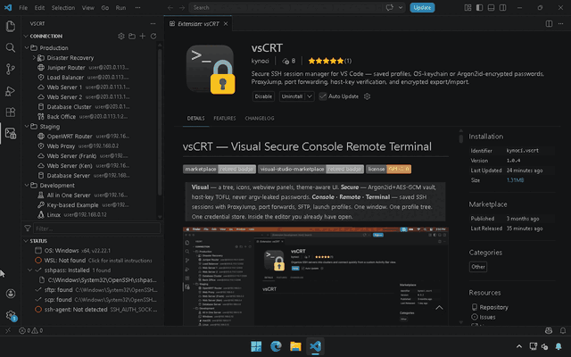

# vsCRT — Visual Secure Console Remote Terminal

[](https://marketplace.visualstudio.com/items?itemName=kynoci.vscrt)
[](https://marketplace.visualstudio.com/items?itemName=kynoci.vscrt)
[](./LICENSE)

> **Visual** — a tree, icons, webview panels, theme-aware UI.
> **Secure** — Argon2id+AES-GCM vault, host-key TOFU, never argv-leaked passwords.
> **Console · Remote · Terminal** — saved SSH sessions with ProxyJump, port forwards, SFTP, launch profiles.
> One window. One profile tree. One credential store. Inside the editor you already have open.



---

## Why vsCRT

Remote work has historically meant juggling **two** tools per server —
a terminal emulator for the shell and a separate GUI for file transfer.
Different profile trees. Passwords typed twice. No awareness of each other.

**vsCRT folds the whole stack into VS Code.**

- Your saved sessions live in a hierarchical tree next to your code.
- Your credentials live in one vault — OS keychain *or* portable
  Argon2id-encrypted bundle you can sync across machines.
- Your SFTP browser, your launch profiles, your ProxyJump chains, and
  your audit log are all one click away from the file you're editing.

Stop context-switching. Stop retyping. Ship faster.

---

## At a glance

| Area                | What you get                                                                                      |
|---------------------|---------------------------------------------------------------------------------------------------|
| **Session tree**    | Folders, subfolders, drag-drop, multi-select, keyboard nav, theme-aware webview.                  |
| **SSH engine**      | Password / publickey / ssh-agent, ProxyJump, `-L`/`-R`/`-D` port forwards, env vars, timeouts.    |
| **Credential vault**| OS keychain by default; opt-in Argon2id + AES-GCM inline vault; auto-lock; status-bar indicator.  |
| **Host-key policy** | `auto-accept` / `prompt-on-first` / `strict`, pre-scan TOFU modal with SHA-256 fingerprint.       |
| **SFTP browser**    | Two-pane UI, drag-drop upload, bulk ops, live progress, chmod, rename, inline preview.            |
| **Launch profiles** | Named server sets that boot together, with per-target staggered delays.                           |
| **Saved commands**  | Per-node shell snippets routed via `terminal.sendText` into the spawned session.                  |
| **CLIs**            | `vscrt` (deep-link shell helper) and `vscrt-remote` (headless SSH reusing the same core).         |
| **Import / export** | Pull from `~/.ssh/config`; push encrypted or password-stripped profile bundles between machines.  |
| **Audit & backup**  | Opt-in JSONL connection log, session recordings, rolling config backups (10-deep).                |
| **Teamwork**        | Read-only shared overlays merge from additional paths; workspace-trust gated; password-stripped.  |

---

## Install

From the VS Code Marketplace:

```
ext install kynoci.vscrt
```

Or search **vsCRT** in the Extensions side-bar and click **Install**.

Open the **vsCRT** icon in the Activity Bar — you'll see the **Connection**
and **Status** views immediately. If this is a fresh machine, the Status
view tells you what (if anything) is missing (`ssh`, `sshpass`, WSL, an
agent) and links to copy-pasteable install instructions.

### Host dependencies

| Requirement            | Why                                                                 |
|------------------------|---------------------------------------------------------------------|
| `ssh` on PATH          | All SSH / SFTP sessions shell out to OpenSSH.                       |
| `sshpass` on PATH      | Only for stored-password auth. Not needed for publickey or agent.   |
| WSL (optional, Win)    | An alternative sshpass provider — vsCRT auto-detects either source. |
| `ssh-keygen`, `ssh-keyscan`, `ssh-copy-id` | Host-key TOFU and one-command public-key install.   |

The **Status** view shows each of these with a traffic-light icon and
— where relevant — a one-click install-help modal.

---

## Quick start

1. **Click the vsCRT icon** in the Activity Bar.
2. **Add a folder** (toolbar → folder icon) — group by environment,
   customer, or project.
3. **Add a server** (toolbar → `+`) — or run
   `vsCRT: Import from ~/.ssh/config` to bulk-import every Host block
   you already have.
4. **Double-click a server** to open a terminal — or right-click for
   `Test Connection`, `Open SFTP Browser…`, `Run Command…`,
   `Change Password`, `Change Icon`, and more.
5. **Press `Ctrl+Alt+S`** (⌘⌥S on macOS) for a fuzzy Quick Connect over
   every server you've saved, with a "Recent" group at the top.

For file transfer: right-click any server → **Open SFTP Browser…**
(or press `Ctrl+Alt+F` / ⌘⌥F) for a two-pane upload / download /
preview experience that respects the same auth + ProxyJump + host-key
policy as the terminal.

---

## What's inside

### Saved session tree

Group by **environment / customer / project**. Unlimited nested
subfolders. Drag-and-drop reorders rows with `before`/`after`/`inside`
drop positions. Multi-select with `Ctrl+click` or marquee to bulk-connect,
bulk-test, or bulk-delete. Per-folder and per-server icon overrides
(codicons or bundled SVGs — Apple, Windows, FreeBSD, Finder, laptop,
load-balancer, switch, Wi-Fi, …).

Expand/collapse state persists across VS Code restarts. The tree lives
next to your code, not in its own window — no alt-tabbing.

### SSH that handles the tricky bits

First-class fields for everything `~/.ssh/config` gives you and then
some:

- **Auth modes** — password (sshpass-driven), publickey, ssh-agent,
  manual prompt. The resolver picks the right one automatically.
- **ProxyJump** — `-o ProxyJump=<chain>`, comma-separated multi-hop
  bastions (`alice@bastion1,bob@bastion2`).
- **Port forwards** — `-L`, `-R`, `-D` (local, remote, dynamic SOCKS)
  with schema-regex validation so nothing injects extra argv.
- **Timeouts & keepalive** — `ConnectTimeout`, `ServerAliveInterval`.
- **Agent integration** — optional agent-forwarding (`-A`),
  `AddKeysToAgent=yes|no|ask|confirm`, `IdentitiesOnly`.
- **Escape hatches** — arbitrary `-o Key=Value` directives plus a raw
  `extraArgs` fragment when you need something exotic.
- **Env vars** — per-node environment for the spawned terminal process
  (not forwarded to the remote; use `SetEnv` via `extraArgs` for that).
- **IPv6 aware** — `[::1]:22` and `user@[2001:db8::1]:2222` parsed correctly.

Non-interactive **Test Connection** reports one of `connected`,
`auth-failed`, `timeout`, `no-credentials`, `cancelled`, `error` — and
offers a one-click jump to the output log when anything but "connected"
comes back.

### Credential vault

Two storage backends, picked per server:

| Mode            | Where the secret lives                        | When to use                                    |
|-----------------|-----------------------------------------------|------------------------------------------------|
| `secretstorage` | VS Code SecretStorage → OS keychain           | Default. Best for a single machine.            |
| `passphrase`    | Inline `enc:v4:` ciphertext in the JSON config| Portable profile. Syncs via git / cloud / USB. |

The passphrase vault uses:

- **Argon2id** (32-byte derived key; parameters embedded in each
  ciphertext so rotating them never breaks old blobs).
- **AES-256-GCM** (12-byte random IV, 16-byte auth tag — tampering is
  detected on decrypt).
- A **strength gate** (`vsCRT.passphraseMinStrength`, 0–4) at enrolment
  and rotation, with no heavy-weight dep bundled.
- **Auto-lock** after 5 min / 15 min / 30 min / 1 hr of idle, or on
  window focus-loss, or never.
- A **status-bar indicator** that shows locked/unlocked state (only
  when a passphrase is enrolled, so OS-keychain-only users see no
  clutter) and announces to screen readers via explicit accessibility
  labels.

Passwords **never touch argv** in the default delivery path. vsCRT ships
three sshpass delivery modes:

| Mode       | How                                                                         |
|------------|-----------------------------------------------------------------------------|
| `tempfile` | Mode-`0600` file (`icacls` on Windows), `sshpass -f` — default everywhere.  |
| `pipe`     | Loopback TCP (Unix) or named pipe (Windows) with one-time token + 60 s TTL. |
| `argv`     | Last-resort fallback — visible via `ps`, used only when the first two fail. |

Crash-resilient: orphan tempfiles older than 24 h are swept at activation;
on `deactivate()` a synchronous sweep tears down anything still outstanding.

### Host-key TOFU done right

Choose how vsCRT treats unknown hosts:

- **`prompt-on-first`** *(default)* — pre-scan the host via
  `ssh-keyscan`, compute the SHA-256 fingerprint, show it in a native
  VS Code modal before ever writing `known_hosts`. Subsequent
  connections are strict. ProxyJump chains can't be pre-scanned, so
  they fall back to ssh's interactive in-terminal prompt.
- **`auto-accept`** — OpenSSH's `accept-new` behaviour.
- **`strict`** — refuse any host not already trusted.

A **pre-shared fingerprint manifest** (`knownFingerprints[]` in the
config) acts as a skip-list: match → modal suppressed; mismatch → user
is alerted to a possible rotation or compromise.

If a server is rebuilt and presents a new key, **Remove Host Key** on
the node context menu wraps `ssh-keygen -R` with a `.old` backup — no
shell trip required.

### Two-pane SFTP browser

Right-click any server → **Open SFTP Browser…** — a dedicated webview
panel (one per node; reopening reveals the existing panel rather than
duplicating it).

- Remote pane + local pane side-by-side; drag between them.
- Upload via toolbar, OS drag-drop, or local-pane drag-drop.
- Download to workspace, Downloads, Home, or a custom folder — with
  last-location persistence per server.
- Bulk download, bulk delete, bulk local delete.
- `ls`, `mkdir`, `rename`, `delete`, `chmod` (POSIX mode string),
  `follow symlink`, `copy path`, `copy scp path`.
- Live transfer progress with bytes/sec + ETA; `Cancel` SIGTERMs every
  active ssh child via a per-session tracker.
- Inline read-only text preview with syntax highlighting (language
  guessed from the file extension).
- Every operation is audit-logged when connection logging is on.
- Works under password auth too: when sshpass can't feed `sftp -b -`
  (its internal ssh child hardcodes `BatchMode=yes`), vsCRT
  transparently falls back to `ssh 'cat > remote' < local`.

### Launch profiles

Named sets of servers that start together. Morning routine:
prod-web-1, prod-web-2, prod-db, prod-cache — all in one click, with
optional millisecond stagger between each launch so ten simultaneous
password prompts don't race.

Add via `vsCRT: Add Launch Profile…`, run via `vsCRT: Run Launch
Profile…`, delete via `vsCRT: Delete Launch Profile…`.

### Saved commands per server

Attach shell snippets to any node:

```jsonc
{
  "name": "Prod Web",
  "endpoint": "deploy@prod-web",
  "commands": [
    { "name": "tail nginx",     "script": "sudo tail -f /var/log/nginx/access.log" },
    { "name": "restart app",    "script": "sudo systemctl restart myapp" },
    { "name": "disk usage",     "script": "df -h | head -20" }
  ]
}
```

Right-click the node → **Run Command…** → pick one → it's sent via
`terminal.sendText` into that node's session. Shell features (pipes,
heredocs, quoting) work normally because the *remote* shell interprets
the string. If no terminal is open for the node yet, vsCRT spawns one
and queues the snippet after a short auth-settle delay.

### CLI companions

Two binaries ship alongside the extension:

| Tool           | Purpose                                                      | How it works                                              |
|----------------|--------------------------------------------------------------|-----------------------------------------------------------|
| `vscrt`        | Shell helper for the extension.                              | Fires `vscode://kynoci.vscrt/*` deep links via `code`.    |
| `vscrt-remote` | Standalone SSH client reusing the extension's core.          | Runs entirely headless — no VS Code needed.               |

```bash
# From any shell — extension-driven
vscrt connect Prod/Web           # open in a new VS Code terminal
vscrt sftp --browser Prod/Web    # open the SFTP browser panel
vscrt ls --filter prod           # search saved profiles
vscrt diag                       # platform + binary availability report

# Headless — CI, scripts, remote exec
vscrt-remote connect  Prod/Web --password-stdin
vscrt-remote test     Prod/Web --timeout 5
vscrt-remote install-key Prod/Web --public-key ~/.ssh/id_ed25519.pub
```

Exit codes on the headless CLI are scriptable (`0` success, `65` profile
not found, `66` secret unavailable, etc.).

### Portable profile bundles

Move a curated server list between machines without copy-pasting JSON:

- **Re-key mode** — re-encrypts every stored password under a fresh
  Argon2id key derived from a passphrase you choose at export time.
  The receiving machine prompts once at import, verifies the check
  token, then re-seals each password under *its* local secret store.
- **Strip mode** — emits a password-free bundle. Safe to commit to a
  shared git repo; import, then populate passwords via **Change
  Password** on each node.

Bundle format: `vscrt-bundle/v1`, a single JSON file with embedded salt,
check token, and folder tree.

### Read-only team overlays

Point `vsCRT.sharedConfigPaths` at one or more extra `vscrtConfig.json`
files (e.g. a repo-scoped `${workspaceFolder}/team-servers.json`).
vsCRT merges each into a synthetic top-level **Shared (read-only)**
folder, strips every password-bearing field, and permits only publickey
or implicit-agent auth through it. The overlay never round-trips into
your personal config. Gated on `workspace.isTrusted`.

### Diagnostics & audit

- **`vsCRT: Show Diagnostics`** — dumps extension version, VS Code
  version, platform, Node, binary availability, vault state, and config
  counts into a Markdown block safe to paste into a bug report. No
  endpoints, no passwords, no salts — ever.
- **Connection log** (`~/.vscrt/connections.log`) — opt-in JSONL audit
  trail, 5 MB rotation, `minimal` or `verbose` verbosity.
- **Session recordings** (`~/.vscrt/sessions/`) — opt-in per-session
  metadata (`*.meta.json`) and optional full terminal transcript
  (`*.cast`).
- **`vsCRT: Show Session History`** — renders metadata + log rows as
  one time-sorted Markdown document in an editor tab (VS Code's
  Markdown preview gives you a zero-webview summary).
- **Rolling backups** (`~/.vscrt/backups/`) — every save snapshots the
  prior file; cap of 10 keeps the folder bounded. `vsCRT: Restore
  Config from Backup…` picks one and swaps it in.

---

## Settings

All settings live under **vsCRT** in Preferences.

| Setting                                 | Type    | Default          | Purpose                                                                            |
|-----------------------------------------|---------|------------------|------------------------------------------------------------------------------------|
| `vsCRT.doubleClickTerminalLocation`     | string  | `panel`          | Where a double-click opens the SSH terminal.                                       |
| `vsCRT.buttonClickTerminalLocation`     | string  | `editor`         | Where a hover-button / palette / menu connect opens the terminal.                  |
| `vsCRT.hostKeyPolicy`                   | string  | `prompt-on-first`| `auto-accept` / `prompt-on-first` / `strict`.                                      |
| `vsCRT.passphraseMinStrength`           | integer | `3`              | Strength gate (0 = any / 4 = very strong) for new or changed passphrases.          |
| `vsCRT.passphraseAutoLock`              | string  | `15min`          | `never` / `5min` / `15min` / `30min` / `1hour` / `onFocusLost`.                    |
| `vsCRT.sessionRecording`                | string  | `off`            | `off` / `minimal` (metadata only) / `full` (metadata + transcript).                |
| `vsCRT.connectionLogging`               | string  | `off`            | `off` / `minimal` / `verbose` — controls the audit log.                            |
| `vsCRT.sharedConfigPaths`               | array   | `[]`             | Additional read-only vscrtConfig overlays (team sharing).                          |

Terminal-location precedence (higher wins): node `terminalLocation`
field → file-level `vsCRT.*TerminalLocation` → VS Code setting → default.

---

## Commands & keybindings

### Keybindings

| Command                       | Windows / Linux | macOS         | Context                               |
|-------------------------------|-----------------|---------------|---------------------------------------|
| `vsCRT.quickConnect`          | `Ctrl+Alt+S`    | `⌘⌥S`         | always                                |
| `vsCRT.openSftpBrowserPick`   | `Ctrl+Alt+F`    | `⌘⌥F`         | `!terminalFocus && !editorFocus`      |

Every other command is on the Command Palette (`Ctrl+Shift+P` →
*vsCRT*) or the view's context menus.

### Command groups

- **Session tree** — Open Config, Add Folder, Add Server, Edit Server,
  Duplicate, Rename Folder, Delete Server / Folder, Refresh, Change Icon.
- **Connect** — Connect, Connect All in Folder, Test Connection,
  Quick Connect, Connect Selected Servers.
- **SFTP** — Open SFTP Browser… (direct), Open SFTP Browser… (picker).
- **Credentials** — Change Password, Change Password Storage Mode,
  Lock Passphrase, Reset Passphrase Setup, Rotate Passphrase KDF
  Parameters, Clear All Stored Passwords, Generate SSH Key Pair,
  Vault Menu.
- **Hosts** — Remove Host Key from `known_hosts`.
- **Import / export** — Import from `~/.ssh/config`, Load Example
  Configuration, Export Profile to Encrypted Bundle…, Import Profile
  from Encrypted Bundle….
- **Launch profiles** — Run / Add / Delete Launch Profile….
- **Snippets** — Run Command… on selected node.
- **Telemetry** — Show Connection History, Show Session Recordings,
  Show Session History.
- **Help & diag** — Show Diagnostics, Show Output Log, Show Help,
  Validate Config, Restore Config from Backup….

---

## Security model

- **Passwords never live in argv by default.** Delivery goes through
  a mode-`0600` tempfile or a token-authed loopback/named pipe with a
  60-second TTL. `argv` is a last-resort fallback.
- **Host keys get a human check.** The default `prompt-on-first` policy
  never writes to `known_hosts` without showing you the SHA-256
  fingerprint first. Strict mode afterwards — ssh itself cannot silently
  auto-accept anything else.
- **Authenticated encryption.** Passphrase-mode ciphertexts are
  AES-256-GCM; tampering is detected on decrypt, not after. KDF
  parameters are embedded in the blob so you can rotate them any time.
- **No telemetry leaves your machine.** Connection logs and session
  recordings are local-only and opt-in. Diagnostics are pull-only and
  secret-free.
- **Safe shell embedding.** Every dynamic value gets single-quoted for
  the target shell (bash vs PowerShell) before it's spliced into the
  terminal command.
- **Input validation at the edit layer.** JSON schema regexes gate
  `jumpHost`, `portForwards`, and `extraSshDirectives` so untrusted
  config can't inject argv.
- **Workspace-trust gating.** Shared overlays are only loaded in a
  trusted workspace.

---

## Data paths

Everything vsCRT writes lives under `~/.vscrt/`:

```
~/.vscrt/
  vscrtConfig.json          main config (schema-stamped, auto-migrated)
  connections.log           JSONL audit trail (rotated at 5 MB → .1)
  backups/                  rolling config backups (newest 10 kept)
    vscrtConfig.<ISO>.json
  sessions/                 session recordings (opt-in)
    *.meta.json             structured metadata
    *.cast                  transcripts (only when recording = full)
```

The main config is a plain JSON file with a JSON Schema
(`schemas/vscrtConfig.schema.json`). Edit it by hand or via the UI —
vsCRT watches for external changes and reloads automatically.

---

## Roadmap & known limitations

- **Serial / RS-232** — not yet supported. SSH only today; serial
  console access is on the roadmap for network-device operators.
- **Telnet / raw TCP** — the data model is open to them; only SSH is
  wired through the connect path at present.
- **Deep-link reveal** — the `/open` deep link focuses the Connection
  view but doesn't yet scroll-and-highlight the target node. Tracked.
- **Windows SSH backend toggle** — when both native `sshpass.exe` and a
  WSL-based one are on PATH, vsCRT picks the first that works. A
  user-facing selector is planned.

Open an issue on
[github.com/kynoci/vscrt/issues](https://github.com/kynoci/vscrt/issues)
to prioritise something.

---

## License

[GPL-3.0-only](./LICENSE) © Kynoci.

---

*vsCRT — **V**isual **S**ecure **C**onsole **R**emote **T**erminal.
A VS Code extension.*
